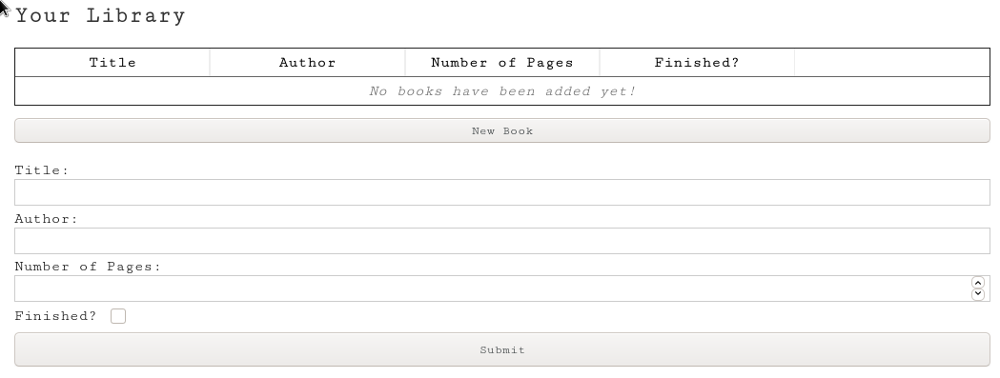

# Your Library - A simple javascript application to keep track of your books

> This repo includes code for the app Your Library, developed as part of Microverse's Full Stack Development Program.

### Check it online!
[Live preview](https://rawcdn.githack.com/fc-anjos/library-app/5a0d34983756a0d0fc635e6c24f00dd2fd168aee/index.html)

## Built With
- Javascript

## Getting Started

To get a local copy up and running clone this repository to your
computer.

## Authors

👤Felipe dos Anjos

- Github: [@githubhandle](https://github.com/fc-anjos)
- Linkedin: [linkedin](https://linkedin.com/in/fc-anjos)

## Show your support

Give a ⭐️ if you like this project!

## 🤝 Contributing

Contributions, issues and feature requests are welcome!

Feel free to check the [issues
page](https://github.com/fc-anjos/library-app/issues).
